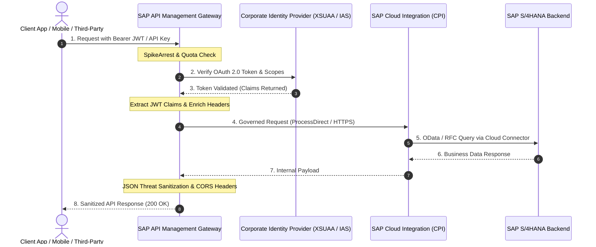

# 🛡️ SAP API Management: Enterprise Security & Governance Hub

[](https://community.sap.com/topics/api-management)
[](https://swagger.io/specification/)
[](policies/)
[](LICENSE)

An architectural reference repository providing production-ready **Policy Bundles**, **OpenAPI 3.0 specifications**, and **API Governance patterns** for **SAP API Management** on **SAP BTP Integration Suite**.

This project demonstrates how to protect, decouple, monitor, and monetize SAP backend systems (S/4HANA, ECC, Cloud Integration, SAP Ariba) using enterprise gateway policies.

---

## 📑 Table of Contents

1. [Architectural Overview](#-architectural-overview)
2. [API-Led Connectivity Architecture](#-api-led-connectivity-architecture)
3. [Production Policy Repository](#-production-policy-repository)
4. [Governed OpenAPI Specifications](#-governed-openapi-specifications)
5. [Security & Traffic Flow Lifecycle](#-security--traffic-flow-lifecycle)

---

## 🏛️ Architectural Overview

SAP API Management acts as the **front door** to enterprise digital assets. It isolates core SAP systems from direct internet exposure, mitigating security vulnerabilities, managing sudden traffic spikes, and offering a unified Developer Portal.



---

## 🌐 API-Led Connectivity Architecture

We structure enterprise APIs into three decoupled tiers:

```
┌────────────────────────────────────────────────────────┐
│ 1. Experience APIs (Mobile, Partner Portal, B2B Web)   │
│    Governed by SAP APIM (Rate Limits, CORS, Monetize)  │
└───────────────────────────┬────────────────────────────┘
                            │
┌───────────────────────────▼────────────────────────────┐
│ 2. Process APIs (Orchestration & Business Logic)       │
│    Orchestrated by SAP Cloud Integration (CPI iFlows)  │
└───────────────────────────┬────────────────────────────┘
                            │
┌───────────────────────────▼────────────────────────────┐
│ 3. System APIs (Core Records: S/4HANA, Salesforce)     │
│    Protected by Cloud Connector & Principal Propagation│
└────────────────────────────────────────────────────────┘
```

---

## 📦 Production Policy Repository

Explore production-grade policies in [`policies/`](policies/):

### 1. Traffic Management
* **[`Spike-Arrest.xml`](policies/traffic/Spike-Arrest.xml)**: Prevents traffic spikes and Distributed Denial of Service (DDoS) by smoothing requests using the leaky bucket algorithm (e.g. `100pm` or `20ps`).
* **[`Quota-Policy.xml`](policies/traffic/Quota-Policy.xml)**: Enforces business tier monetization limits (e.g., Free Tier: 1,000 calls/month; Gold Tier: 100,000 calls/month).

### 2. Security & Authentication
* **[`Verify-API-Key.xml`](policies/security/Verify-API-Key.xml)**: Validates client API Key passed via header `APIKey` or query parameter.
* **[`OAuth-v20-Verify-Token.xml`](policies/security/OAuth-v20-Verify-Token.xml)**: Validates OAuth 2.0 access tokens against SAP BTP XSUAA or SAP Cloud Identity Services.
* **[`CORS-Preflight.xml`](policies/security/CORS-Preflight.xml)**: Handles browser `OPTIONS` preflight requests for Single Page Apps (Angular, React, SAP Fiori).

### 3. Mediation & Transformation
* **[`Extract-JWT-Claims.xml`](policies/mediation/Extract-JWT-Claims.xml)**: Extracts user email, tenant ID, and custom roles from JSON Web Tokens without backend overhead.
* **[`JSON-to-XML.xml`](policies/mediation/JSON-to-XML.xml)**: Converts modern REST payloads to legacy SOAP/XML for backend compatibility.

---

## 📜 Governed OpenAPI Specifications

* **[`s4hana-business-partner-v1.yaml`](openapi/s4hana-business-partner-v1.yaml)**: Complete OpenAPI 3.0.3 specification exposing S/4HANA Business Partner entities with strict response schemas, error codes, and security definitions.

---

## 🔒 Security Best Practices

1. **Never expose raw internal URLs**: All backend S/4HANA endpoints must be masked behind APIM target endpoints.
2. **Apply Spike Arrest before Quota**: Reject abusive burst traffic before performing expensive database or cache lookups.
3. **Principal Propagation**: Use SAP Cloud Connector and JWT identity propagation to ensure the end-user's enterprise authorization is honored in ABAP.
